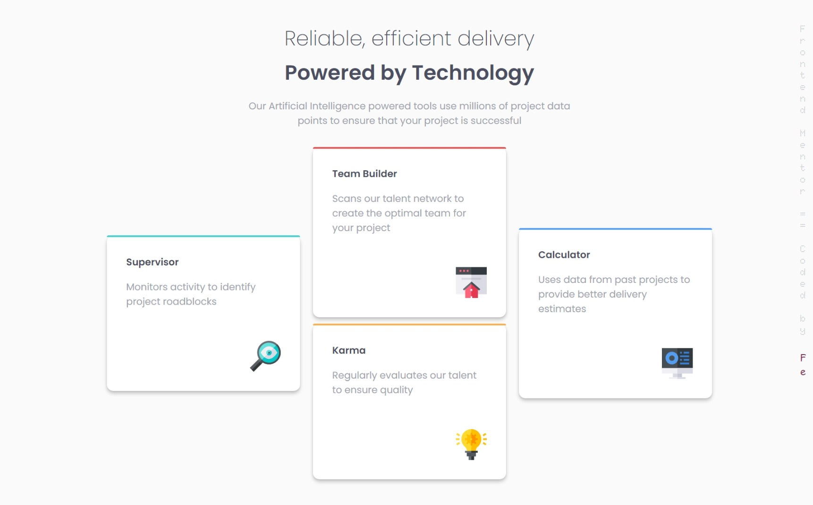

# Frontend Mentor - Four card feature section solution

This is the solution to the [Four card feature section challenge on Frontend Mentor](https://www.frontendmentor.io/challenges/four-card-feature-section-weK1eFYK) Coded By [Fe](feyselteshome05@gmail.com).

## Table of contents
- [Overview](#overview)
  - [The challenge](#the-challenge)
  - [Screenshot](#screenshot)
  - [Links](#links)
- [My process](#my-process)
  - [Built with](#built-with)
  - [What I learned](#what-i-learned)
- [Author](#author)

## Overview

### The challenge

Users should be able to:

- View the optimal layout for the site depending on their device's screen size

### Screenshot

#### Desktop Design

#### Mobile Design

I decided not to attach the mobile screenshot here since it is pretty much long so if you need to see it you can navigate to the [images directory](https://github.com/Code-Me-Well/four-card-feature-section-master/blob/main/images/mobile-result.png) and it should be there.

### Links

- Solution URL: [Github Repo](https://github.com/Code-Me-Well/Product-preview-card-component-main)
- Live Site URL: [Vercel Site](https://four-card-feature-section-master-cyan-five.vercel.app/)

## My process

### Built with

- Semantic HTML5 markup
- CSS custom properties
- Flexbox

### What I learned

I learned that I might have underestimated the power of Flexbox. With Flexbox, I can accomplish major tasks in an easier way and with fewer lines of code. I mainly used it for responsiveness and especially to center my divs, which was always a challenge before. 

## Author

- Frontend Mentor - [@Code-Me-Well](https://www.frontendmentor.io/profile/Code-Me-Well)